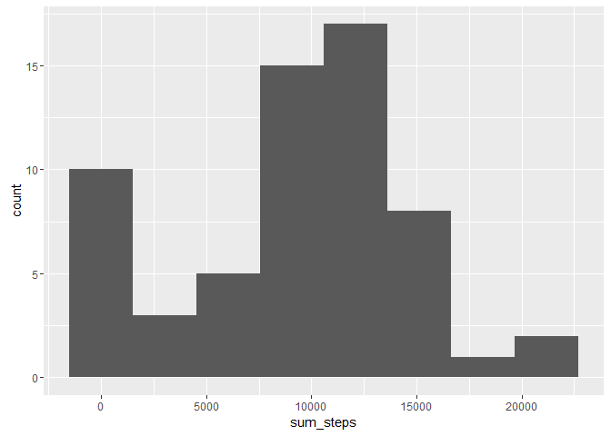
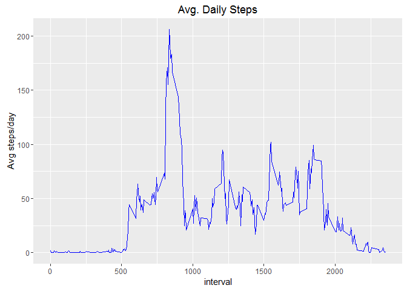
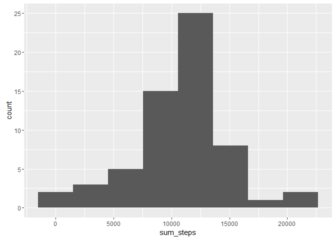
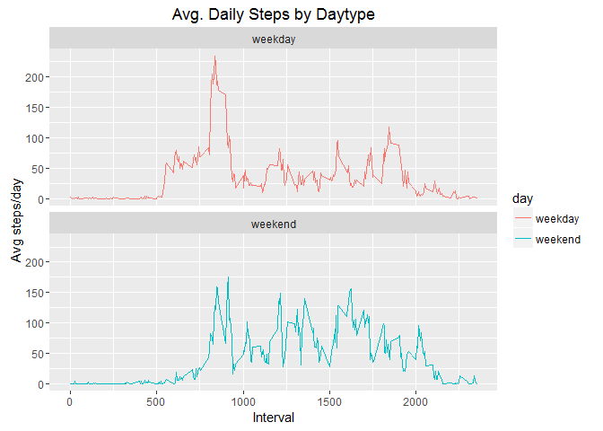

# Activity Patterns - Reproducible Research Course Project 1
Muhammad Mudassir Khan  
August 31, 2016  


## Loading and preprocessing the data


```r
library(data.table)
act <- fread("activity.csv")
str(act)
```

```
## Classes 'data.table' and 'data.frame':	17568 obs. of  3 variables:
##  $ steps   : int  NA NA NA NA NA NA NA NA NA NA ...
##  $ date    : chr  "2012-10-01" "2012-10-01" "2012-10-01" "2012-10-01" ...
##  $ interval: int  0 5 10 15 20 25 30 35 40 45 ...
##  - attr(*, ".internal.selfref")=<externalptr>
```
Since the Dates are stored as character values we would want to convert them into Date objects for analysis. Checkout this [data.table cheatsheet][1] in case of any confusion regarding the below syntax.


```r
library(lubridate)
```

```
## 
## Attaching package: 'lubridate'
```

```
## The following objects are masked from 'package:data.table':
## 
##     hour, mday, month, quarter, wday, week, yday, year
```

```
## The following object is masked from 'package:base':
## 
##     date
```

```r
act[, date := ymd(date)]
class(act$date)
```

```
## [1] "Date"
```

## What is mean total number of steps taken per day?

To calculate total number of steps each day :


```r
tot_per_day <- act[, .(sum_steps = sum(steps, na.rm = TRUE)), by = date]
```

Lets plot a histogram of of total number of steps per day


```r
library(ggplot2)
g <- ggplot(tot_per_day, aes(sum_steps))
g + geom_histogram(bins = 8)
```

<!-- -->

Checking the mean and median for per day steps

```r
tot_per_day[, .(mean = mean(sum_steps), median = median(sum_steps))]
```

```
##       mean median
## 1: 9354.23  10395
```

## What is the average daily activity pattern?

Calculating interval wise averages across all the days


```r
avg_int <- act[, .(steps = mean(steps, na.rm = TRUE)), by = interval]
```

Plotting the time series plot average steps taken at a given interval


```r
ggplot(avg_int, aes(interval, steps)) + geom_line(colour = "blue") +
    labs(y = "Avg steps/day") + ggtitle("Avg. Daily Steps")
```

<!-- -->

```r
max <- avg_int[which.max(steps)]
max
```

```
##    interval    steps
## 1:      835 206.1698
```

The "835" interval has the highest avg steps per day.

## Imputing Missing Values

Calculating total no of rows with missing values


```r
table(is.na(act$steps))
```

```
## 
## FALSE  TRUE 
## 15264  2304
```

Imputing NA's in the dataset by assigning the avg steps per interval computed earlier.


```r
act2 = copy(act)
act2$steps <- as.numeric(act2$steps)
act2[ is.na(steps), steps := {i = match(interval, avg_int$interval) ; avg_int[i][[2]]} ]
```

The above step first subsets only rows containing NA's and matches the interval values to find the corresponding index in the `avg_int` variable. Then it replaces the NA value in `act2` with the corresponding interval value from `avg_int`.

Summing up the total no of steps per day and making the histogram.

```r
tot_per_day2 <- act2[, .(sum_steps = sum(steps, na.rm = TRUE)), by = date]
g <- ggplot(tot_per_day2, aes(sum_steps))
g + geom_histogram(bins = 8)
```

<!-- -->

Checking the mean and median for per day steps

```r
tot_per_day2[, .(mean = mean(sum_steps), median = median(sum_steps))]
```

```
##        mean   median
## 1: 10766.19 10766.19
```

We can see that imputing missing values results in equal mean and median for total steps per day.

## Are there differences in activity patterns between weekdays and weekends?

Creating the factor variable classifying the observation as weekend or weekday.


```r
act[, day := factor(ifelse(wday(date) %in% c(1,7), "weekend", "weekday")) ]
```

Finding mean steps per interval based on the type of the day.


```r
avg_int_day <- act[, .(steps = mean(steps, na.rm = TRUE)), by = .(day,interval)]
```

Plotting the time series plot average steps taken at a given interval


```r
ggplot(avg_int_day, aes(interval, steps, color = day)) + geom_line() +
    labs(y = "Avg steps/day", x= "Interval") +
    ggtitle("Avg. Daily Steps by Daytype") + facet_wrap(~day, ncol = 1, nrow = 2)
```

<!-- -->

We can see that the person is moving more at an earlier point of the day during the weekdays, but is more active throughout the weekend. The low values in weekday can be due to the person working and not getting time for workouts.


[1]: https://s3.amazonaws.com/assets.datacamp.com/img/blog/data+table+cheat+sheet.pdf
